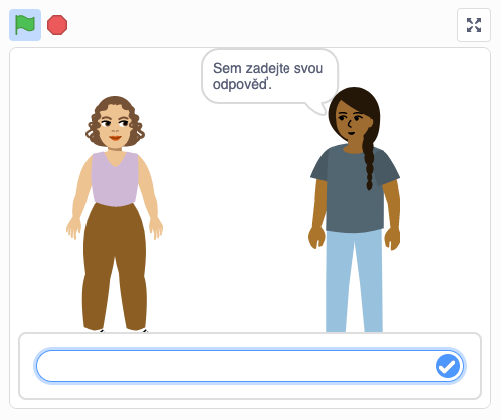

## Introduction

Have you ever wondered how people are feeling but, because you don’t speak their language, you can't ask them? Make an e-card for family, friends or peers across the world who speak a different language. Choose a sprite to represent you speaking in their language.

### What you will make

Click the green flag. When the left-hand sprite stops speaking, click the right-hand sprite to write a reply in the box provided. Then click the blue tick to translate your message.

--- no-print ---

  <iframe src="https://scratch.mit.edu/projects/399169995/embed" allowtransparency="true" width="485" height="402" frameborder="0" scrolling="no" allowfullscreen></iframe>

--- /no-print ---

--- print-only ---

{:width="430px"}

--- /print-only ---

--- collapse ---
---
title: What you will need
---
### Hardware
+ A Computer or tablet capable of running Scratch
 
### Software
+ Scratch 3 (either [online](https://scratch.mit.edu/){:target="_blank"} or [offline](https://scratch.mit.edu/download){:target="_blank"})
 
### Downloads
+ Download the project [starter file](http://rpf.io/p/en/how-are-you-get){:target="_blank"} if working offline

--- /collapse ---

--- collapse ---
---
title: What you will learn
---

+ How to use two Scratch extension blocks: `Translate`{:class="block3extensions"} and `Text to Speech`{:class="block3extensions"}
+ How to choose a sprite to represent yourself

--- /collapse ---

--- collapse ---
---
title: Additional information for educators
---
You can download the completed project [here](http://rpf.io/p/en/how-are-you-get){:target="_blank"}.

If you need to print this project, please use the [printer-friendly version](https://projects.raspberrypi.org/en/projects/how-are-you-?/print){:target="_blank"}.

--- /collapse ---
