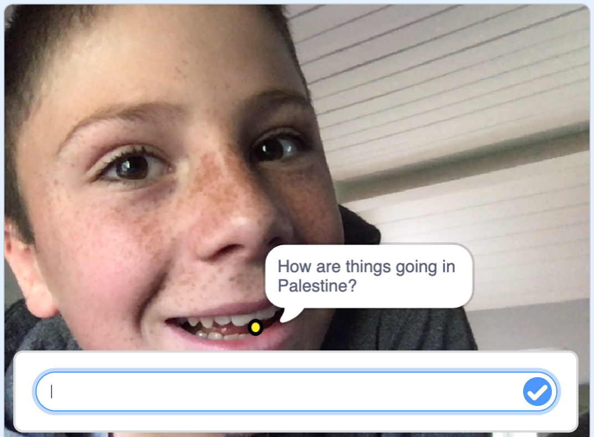

## Introduction

Have you ever wondered how people are doing but, because you don’t speak their language, you can't ask them?

Make an e-card for family, friends or peers across the world who speak a different language. Add a selfie so it looks like you're speaking in their mother tongue!

Hey, you'll seem billingual or even trilingual. Impressive!

### What you will make

--- collapse ---
---
title: What you will need
---
### Hardware

+ A computer capable of running Scratch

### Software

+ Scratch 3 (either online or offline)

### Additional craft materials

+ None

### Downloads

+ None

--- /collapse ---

--- collapse ---
---
title: What you will learn
---

+ Use two Scratch Extension Blocks: Translate and Text to Speech.
+ Use the Camera option to create a selfie.

--- /collapse ---

--- collapse ---
---
title: Additional information for educators
---

If you need to print this project, please use the [printer-friendly version](https://projects.raspberrypi.org/en/projects/how-are-you-?/print){:target="_blank"}.

--- /collapse ---
