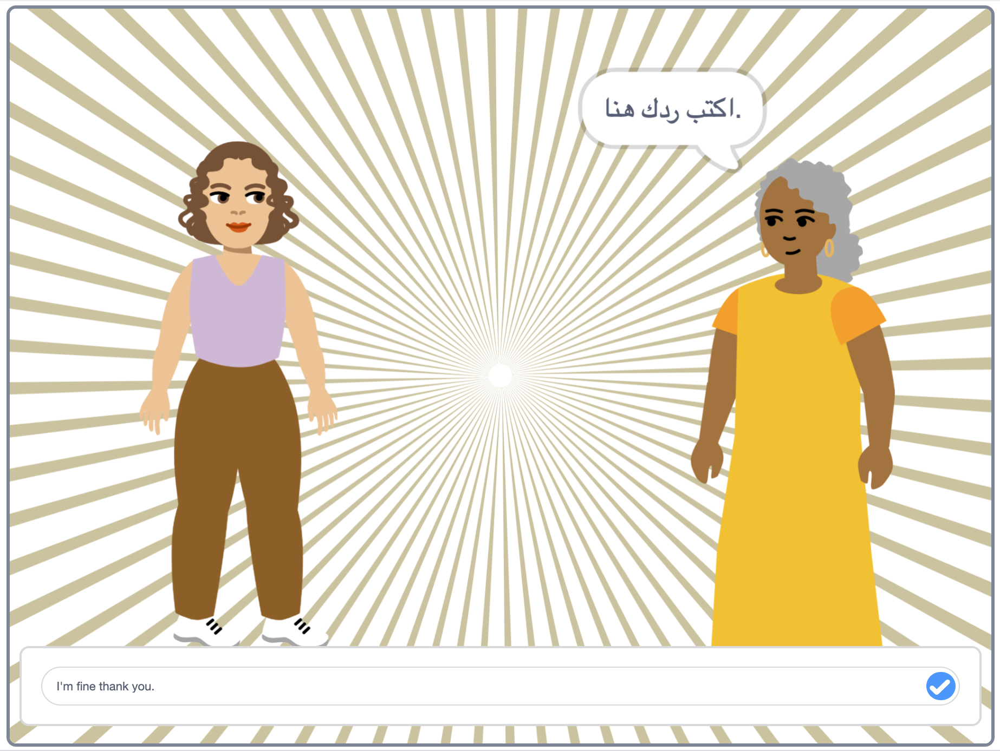

## Introduction

Have you ever wondered how people are doing but, because you don’t speak their language, you can't ask them? Make an e-card for family, friends or peers across the world who speak a different language. Choose a sprite to represent you speaking in their language. Impressive!

### What you will make

--- no-print ---

  <iframe allowtransparency="true" width="485" height="402" src="https://scratch.mit.edu/projects/399169995/embed"
frameborder="0"></iframe>

--- /no-print ---

--- print-only ---

--- /print-only ---

--- collapse ---
---
title: What you will need
---
### Hardware

+ A computer capable of running Scratch

### Software

+ Scratch 3 (either [online](http://rpf.io/scratchon){:target="_blank"} or [offline](http://rpf.io/scratchoff){:target="_blank"})

### Additional materials

+ None

### Downloads

+ To open this project offline, follow the link to the Scratch Offline Editor: [www.scratch.mit.edu/download](https://scratch.mit.edu/download){:target="_blank"}.

--- /collapse ---

--- collapse ---
---
title: What you will learn
---

+ Use two Scratch Extension blocks: `Translate`{:class="block3extensions"} and `Text to Speech`{:class="block3extensions"}.
+ Choose a sprite to respresent yourself.

--- /collapse ---

--- collapse ---
---
title: Additional information for educators
---
Open the 'How are you?' finished Scratch project [online](http://rpf.io/how-are-you-get){:target="_blank"}.

If you need to print this project, please use the [printer-friendly version](https://projects.raspberrypi.org/en/projects/how-are-you-?/print){:target="_blank"}.

--- /collapse ---
