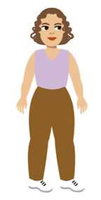
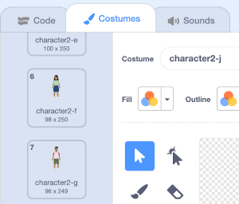
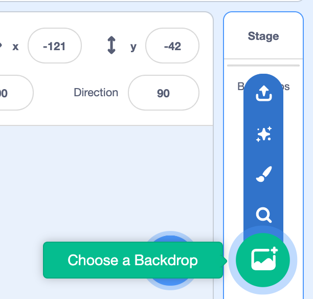

**Online**: Open the 'How are you?' starter Scratch project [online](http://rpf.io/how-are-you-on){:target="_blank"}.  If you have a Scratch account you can make a copy by clicking **Remix**.

To open this project offline, follow the link to the Scratch Offline Editor: [www.scratch.mit.edu/download](https://scratch.mit.edu/download){:target="_blank"}.

You should see a young person - that's you (for now!). We really need you to make things more interesting! 

Click the green flag to run the project. It will sound and read like you are speaking double-dutch! It is infact Arabic. Read on to find out what's being said.

<div>
<iframe src="https://scratch.mit.edu/projects/395701995/embed" allowtransparency="true" width="485" height="402" frameborder="0" scrolling="no" allowfullscreen></iframe>
</div>

## Translate your message

Think of the person you want to send your message to. We will call that person the 'respondent'. 

What langauge does the respondent speak?

--- task ---

+ Open the code editor. The current `say` {:class=“block3looks”} block says "How are things going in Palenstine?". Delete the message that is there and type in your own personal message.

+ Choose the respondent's language i.e. the language you want to translate your message in to. There are 40 languages in Scratch to choose from! Let's hope the language the respondent speaks is included in those 40.
```blocks3
when flag clicked
set voice to [tenor v] ::tts
(translate [How are things going in Palenstine?] to [Arabic v] ::translate) ::tts
say ( translate [How are things going in Palenstine?] to (Arabic v) ::translate ) for (4) seconds
```
Notice you need to select the language twice and paste your message in twice in order to create both spoken and written translation.

+ If your message is long, you may need to change the value of how long your message is shown for. Why not run the program again to check if the timing fits?
```blocks3
say ( translate [How are things going in Palenstine?] to (Arabic v) ::translate ) for (4) seconds
```
+ If you like, change the tone of the voice so it  represents you.
```blocks3
set voice to [tenor v] ::tts
```
--- /task ---

## Change your sprite



As the message is from you, why not make sure the sprite looks a bit like you? It will then appear that you’re the one speaking and typing the message!

--- task ---
+ Go to Costumes. Select, by highlighting, one of the ten cosutmes available. The sprite should have automatically changed.

+ Run the program to see and hear yourself speaking another langauge. Impressive!



--- /task ---
## Choose a Backdrop
--- task ---

+ The current backdrop is little too white! Fancy a different one? Go to 'Choose a Backdrop'. There's loads in the gallery to choose from.



--- /task ---

## Nine more to go!

In this project you experienced two Scratch Extension Blocks: Translate and Text to Speech. There are another nine more to get to know! Why not begin to explore them by clicking the Extension Block tab in the Scratch Project. It looks like the example image below.


--- save ---
