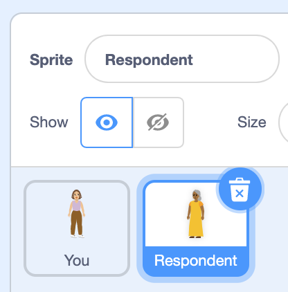
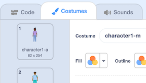

**Online**: Open the 'How are you?' starter Scratch project [online](http://rpf.io/how-are-you-on){:target="_blank"}.  If you have a Scratch account you can make a copy by clicking **Remix**.

To open this project offline, follow the link to the Scratch Offline Editor: [www.scratch.mit.edu/download](https://scratch.mit.edu/download){:target="_blank"}.

You can then download the starter project at [rpf.io/p/en/how-are-you-go](https://rpf.io/p/en/how-are-you-go).

You should see a young person - that's you (for now!). Click the green flag to run the project. Read on to find out what's being said in Arabic.

<div>
<iframe src="https://scratch.mit.edu/projects/399133454/embed" allowtransparency="true" width="485" height="402" frameborder="0" scrolling="no" allowfullscreen></iframe>
</div>

## Translate your message

Think of the person you want to send your message to. We will call that person the 'respondent'. 

What langauge does the respondent speak?

--- task ---

+ Open the code editor. Currently in the `say`{:class="block3looks"} block you say "Type your message here". Delete the message that is there and type in your own personal message.

+ Choose the respondent's language i.e. the language you want to translate your message in to. It's currently set to Arabic.  There are 40 languages in Scratch to choose from! Let's hope the language the respondent speaks is included in those 40.
```blocks3
when flag clicked
set voice to [tenor v] ::tts
(translate [Type your message here] to [Arabic v] ::translate) ::tts
say ( translate [Type your message here] to (Arabic v) ::translate ) for (4) seconds
```
Notice you need to select the language twice and paste your message in twice in order to create both spoken and written translation.

+ If your message is long, you may need to change the value of how long your message is shown for. Why not run the program again to check if the timing fits?
```blocks3
say ( translate [Type your message here] to (Arabic v) ::translate ) for (4) seconds
```
+ If you like, change the tone of the voice so it  represents you.
```blocks3
set voice to [tenor v] ::tts
```
--- /task ---

## Change your sprite


As the message is from you, why not choose a sprite costume to represent you? It will then appear that you’re the one speaking and typing the message!

--- task ---
+ Go to Costumes. Select, by highlighting, one of the ten cosutmes available. The sprite costume should automatically change on the stage.

+ Run the program to see and hear yourself speaking another langauge. Impressive!


--- /task ---
## Choose a Backdrop
--- task ---

+ The current backdrop is little too white! Fancy a different one? Go to 'Choose a Backdrop'. There's loads in the gallery to choose from.


--- /task ---

## Respondent's reply

The respondent wants to reply to your message. Modify the program so they can message you back.

--- task ---

+ To do this, you will need to attach two extra blocks of code to sprite 'You'. The blocks will let the respondent know that they can reply by clicking their sprite (which we've yet to make appear). 

+ Select sprite 'You'. Find the `say`{:class="block3looks"} block from Looks
+ Again in the sprite 'You', find the `translate`{:class="block3extensions"} block in the extension block, Text to Speech.

```blocks3
say ( translate [Reply by clicking the other sprite.] to (Arabic v) ::translate ) for (4) seconds
(translate [Reply by clicking the other sprite.] to [Arabic v] ::translate) ::tts
```
+ Don't forget to select the respondent's language again.

--- /task ---

--- task ---
+ Now select the sprite 'Respondent'.

+ To see the Respondent, you also need to switch their show 'eye' on.


+ In the code area outlined in black below, change the language option. Choose the language you are most familiar with - the program will translate the respondent's message so you can hear and read it.
```blocks3
when this sprite clicked
set voice to [squeak v] ::tts
ask ((translate [Type in your reply here.] to [Arabic v] ::translate) ::tts) and wait
+say ( translate (answer) to (English v) ::translate ) for (2) seconds
+(translate (answer) to [English v] ::translate) ::tts
```
--- /task ---

--- task ---

+ Change the look of the sprite 'Respondent' so it looks more like the Respondent i.e. your family member, friend or peer. Select the sprite, click on the Costumes tab and select one of the available costumes to represents them.


--- /task ---

--- task ---

+ Run the program again. Is it working as you want it to? If so, why not try it out on a friend or family member? Share the project link or search for [How are you?](https://rpf.io/how-are-you-on) project.

--- /task ---

--- save ---
