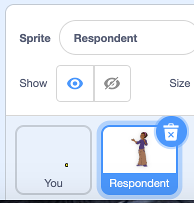

## Receive a message back
+ The respondent wants to reply to your message. Modify the program so they can message you back.

--- task ---

+ To do this, you will need to add two extra blocks of code to 'You' sprite. The blocks will let the respondent know that they can reply by clicking the character. 

+ Don't forget to select the respondent's language again.

```blocks3
say ( translate [Please answer by clicking the character.] to (Arabic v) ::translate ) for (4) seconds
(translate [Please answer by clicking the character.] to [Arabic v] ::translate) ::tts
```

--- /task ---

--- task ---

+ Now select the sprite 'Respondent'.



+ In the code area, change the language option. Choose the language you are most familiar with - the program will translate the respondent's message so you can hear and read it.

```blocks3
when this sprite clicked
set voice to [squeak v] ::tts
ask ((translate [Type in your reply here.] to [Arabic v] ::translate) ::tts) and wait
say ( translate (answer) to (English v) ::translate ) for (2) seconds
(translate (answer)  to [English v] ::translate) ::tts
```
--- /task ---

--- task ---

+ Optional: change the look of the sprite 'Respondent'. Select the sprite, click on its Costumes tab and select Choose a Costume. Can you find a sprite that looks like or represents the respondent?!

--- /task ---

--- task ---

+ Run the program again. Is it working as you want it to? If so, why not try it out on a friend or family member? Share the project link or search for the [How are you] (https://learning-admin.raspberrypi.org/en/projects/how-are-you) project.

--- /task ---
